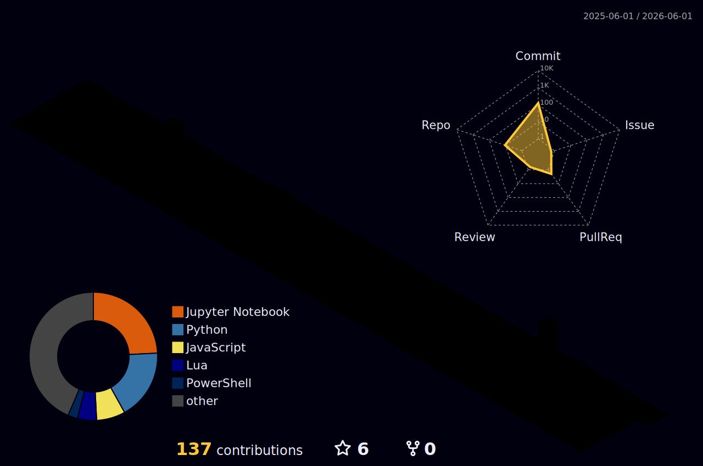

<div align="center">


<br>


</div>


<div align="center">

*🌸 Как Фрирен собирает заклинания тысячу лет — так я собираю модели, алгоритмы и данные. Каждый коммит — новое заклинание в гримуаре. 🌸*

</div>

<br>

### 🏯 Обо мне

```python
class Siesher:
    """A mage who collects spells across the vast lands of Data Science."""

    def __init__(self):
        self.name = "Maksim"
        self.role = "Data Scientist"
        self.domain = "Banking & Finance"
        self.stack = ["Transformers", "Graph Neural Networks", "LLM", "NLP"]
        self.project = "MIST — Math Intelligent Tutoring System"
        self.education = "BMSTU (Bauman Moscow State Technical University)"

    def philosophy(self):
        return "The journey of 1000 years begins with a single commit"
```


### 📬 Связаться со мной

<div align="center">

[](https://t.me/Siesher)
[](mailto:rmnfn1992@outlook.com)
[](https://github.com/Siesher)

</div>


### 🛡️ Стек технологий

<div align="center">


<br><br>

<br><br>


</div>


### 📜 Gists

<div align="center">

[](https://gist.github.com/Siesher/fd31d015d96abb3d01856e4340dd247e)
[](https://gist.github.com/Siesher/60f18d6f3f6ee871827b467bf68016a7)

</div>


### ⏱️ WakaTime

<!--START_SECTION:waka-->

```txt
From: 06 April 2026 - To: 13 April 2026

Python       4 hrs 35 mins         ███████████░░░░░░░░░░░░░░   44.64 %
Other        4 hrs 22 mins         ██████████▓░░░░░░░░░░░░░░   42.48 %
Markdown     1 hr 6 mins           ██▓░░░░░░░░░░░░░░░░░░░░░░   10.82 %
JSON         3 mins                ░░░░░░░░░░░░░░░░░░░░░░░░░   00.61 %
Lua          3 mins                ░░░░░░░░░░░░░░░░░░░░░░░░░   00.56 %
```

<!--END_SECTION:waka-->


### 🏆 Трофеи

<div align="center">


</div>


### 📊 GitHub статистика

<div align="center">


&nbsp;


<br><br>


</div>


### 🐍 Snake

<div align="center">

<picture>
  <source media="(prefers-color-scheme: dark)" srcset="https://raw.githubusercontent.com/Siesher/Siesher/output/github-snake-dark.svg" />
  <source media="(prefers-color-scheme: light)" srcset="https://raw.githubusercontent.com/Siesher/Siesher/output/github-snake.svg" />
  
</picture>

</div>


### 🗺️ 3D карта вкладов

<div align="center">



</div>


### 📈 График активности

<div align="center">


</div>


<div align="center">

<br>


<br><br>

*🌸 «Маги живут долго. И потому мы не торопимся — но каждое заклинание делаем совершенным.» 🌸*

<br>

</div>


