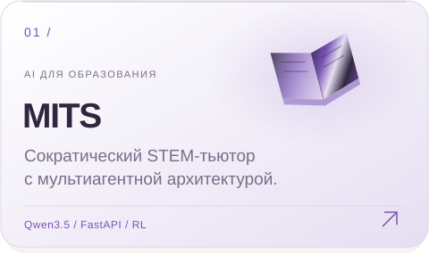
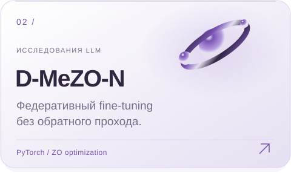
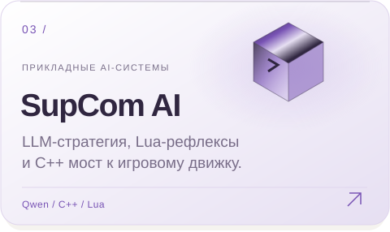
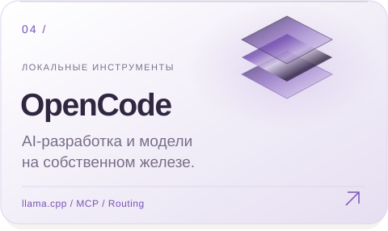

<picture>
  <source media="(prefers-color-scheme: dark)" srcset="./assets/header-dark.svg">
  
</picture>

  <a href="https://siesher.github.io"><b>Визитка ↗</b></a> &nbsp; · &nbsp;
  <a href="https://t.me/Siesher">Telegram</a> &nbsp; · &nbsp;
  <a href="https://huggingface.co/Siesher">Hugging&nbsp;Face</a> &nbsp; · &nbsp;
  <a href="mailto:rmnfn1992@outlook.com">Email</a>

 

**Привет, я Максим.** Data Scientist в банковской сфере и финансах, студент МГТУ им. Баумана.
Исследую языковые модели и графовые нейросети, экспериментирую с обучением LLM и создаю локальные AI-инструменты.

Как Фрирен собирает заклинания, я собираю идеи — и проверяю их в коде.

 

### Избранные заклинания

  <a href="https://github.com/Siesher/MITS"><picture>
    <source media="(prefers-color-scheme: dark)" srcset="./assets/project-mits-dark.svg">
    
  </picture></a>
  <a href="https://github.com/Siesher/dmezo"><picture>
    <source media="(prefers-color-scheme: dark)" srcset="./assets/project-dmezo-dark.svg">
    
  </picture></a>
  <a href="https://github.com/Siesher/AI_For_Supreme_Com"><picture>
    <source media="(prefers-color-scheme: dark)" srcset="./assets/project-supcom-dark.svg">
    
  </picture></a>
  <a href="https://github.com/Siesher/opencode-homelab"><picture>
    <source media="(prefers-color-scheme: dark)" srcset="./assets/project-opencode-dark.svg">
    
  </picture></a>

Открыть остальные страницы гримуара

- [Qwen3 + LoRA](https://github.com/Siesher/Qwen3_LoRA_pet) — адаптация языковой модели под свои задачи.
- [Generator for reasoning](https://github.com/Siesher/Generator_for_reasoning) — генерация данных для обучения рассуждению.
- [LoRA template](https://gist.github.com/Siesher/fd31d015d96abb3d01856e4340dd247e) · [GNN fraud detection](https://gist.github.com/Siesher/60f18d6f3f6ee871827b467bf68016a7) — практические заготовки.

 

### Инструменты моей магии

`Python` `PyTorch` `Transformers` `scikit-learn` `LoRA` 
`Pandas` `SQL` `Graph ML` `C++` `Linux` `Docker` `Git`

 

### Путешествие продолжается

<picture>
  <source media="(prefers-color-scheme: dark)" srcset="https://raw.githubusercontent.com/Siesher/Siesher/output/github-snake-dark.svg">
  
</picture>

Развернуть трёхмерную карту путешествия

<picture>
  <source media="(prefers-color-scheme: dark)" srcset="./profile-3d-contrib/profile-night-view.svg">
  
</picture>

 

✦ &nbsp; Всегда найдётся ещё одно интересное заклинание.

