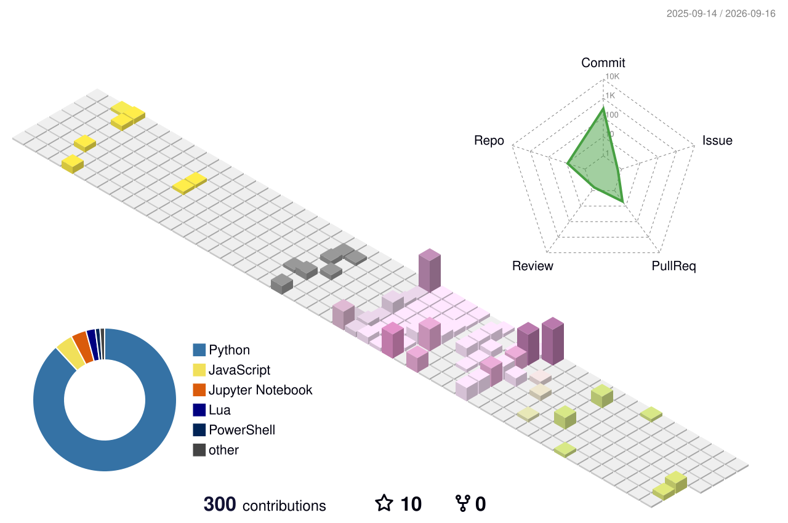

<picture>
  <source media="(prefers-color-scheme: dark)" srcset="./assets/header-dark.svg">
  
</picture>

  <a href="https://siesher.github.io">Визитка</a> &nbsp; · &nbsp;
  <a href="https://t.me/Siesher">Telegram</a> &nbsp; · &nbsp;
  <a href="mailto:rmnfn1992@outlook.com">Email</a> &nbsp; · &nbsp;
  <a href="https://huggingface.co/Siesher">Hugging&nbsp;Face</a>

 

### Привет, я Максим

Data Scientist в банковской сфере и финансах, студент МГТУ им. Баумана.
Исследую языковые модели и графовые нейросети, экспериментирую с обучением LLM и собираю локальные AI-инструменты.

Как Фрирен собирает заклинания, я собираю идеи — и проверяю их в коде.

 

### Избранные проекты

**[MITS](https://github.com/Siesher/MITS)** &nbsp; / &nbsp; AI для образования 
Сократический STEM-тьютор: мультиагентная архитектура и языковая модель, обученная с RL. 
Python · FastAPI · Next.js · Reinforcement learning

**[D-MeZO-N](https://github.com/Siesher/dmezo)** &nbsp; / &nbsp; Исследования LLM 
Децентрализованный fine-tuning без backprop: оптимизация нулевого порядка и дифференциальная приватность. 
PyTorch · Federated learning · Zeroth-order optimization

**[SupCom LLM Bot](https://github.com/Siesher/AI_For_Supreme_Com)** &nbsp; / &nbsp; AI в играх 
Локальная языковая модель управляет ботом в Supreme Commander: Forged Alliance. 
Qwen · Ollama · C++ · Lua

**[opencode-homelab](https://github.com/Siesher/opencode-homelab)** &nbsp; / &nbsp; Инструменты 
Локальный стек AI-разработки с маршрутизацией контекста и запуском моделей на своём железе. 
OpenCode · llama.cpp · MCP

Ещё немного магии — эксперименты и заметки

- [Qwen3 + LoRA](https://github.com/Siesher/Qwen3_LoRA_pet) — адаптация языковой модели под свои задачи.
- [Generator for reasoning](https://github.com/Siesher/Generator_for_reasoning) — генерация данных для обучения рассуждению.
- [LoRA template](https://gist.github.com/Siesher/fd31d015d96abb3d01856e4340dd247e) · [GNN fraud detection](https://gist.github.com/Siesher/60f18d6f3f6ee871827b467bf68016a7) — небольшие практические заготовки.

 

### Рабочий набор

**Модели** &nbsp; PyTorch · Transformers · scikit-learn · LoRA 
**Данные** &nbsp; Python · Pandas · SQL · Graph ML 
**Инструменты** &nbsp; Linux · Docker · Git · C++

 

### Путешествие продолжается

<picture>
  <source media="(prefers-color-scheme: dark)" srcset="https://raw.githubusercontent.com/Siesher/Siesher/output/github-snake-dark.svg">
  
</picture>

Карта путешествия в 3D

<picture>
  <source media="(prefers-color-scheme: dark)" srcset="./profile-3d-contrib/profile-night-view.svg">
  
</picture>

 

✦ &nbsp; Всегда найдётся ещё одно интересное заклинание.

